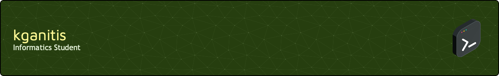

<!--
**kganitis/kganitis** is a ✨ _special_ ✨ repository because its `README.md` (this file) appears on your GitHub profile.
-->

### About Me
- I am a postgraduate student in **Informatics** with an undergraduate degree in **Economic Sciences**.
- I have 3.5 years of experience as a **PL/SQL developer** working on a large-scale payroll system with over 50,000 active employees within a significant national organization.
- I pick up new things quickly and have a good understanding of programming and computer science in general.

### Currently
- Started a new role in **cybersecurity**, marking a significant career shift from my programming-focused background to an entirely new field. Focusing on gaining theoritical knowledge and practical experience.
- Working on my MSc thesis: **"Enhancing Endpoint Detection and Incident Response with Velociraptor"**.
- Building my personal photography portfolio website.

### I'm also interested in
- Game development & game engine programming.
- Machine learning.
